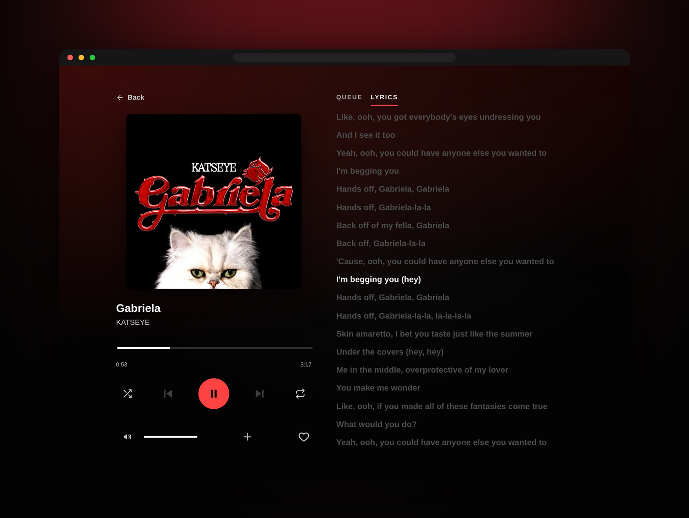
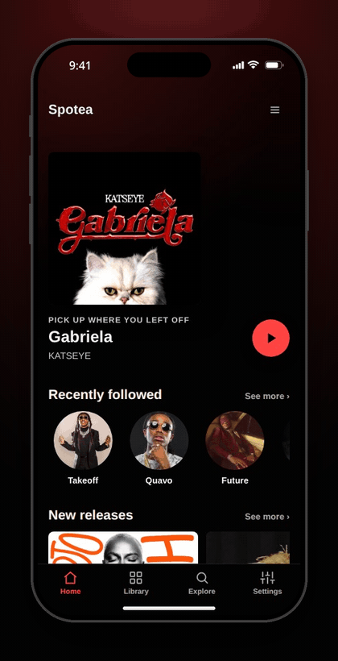
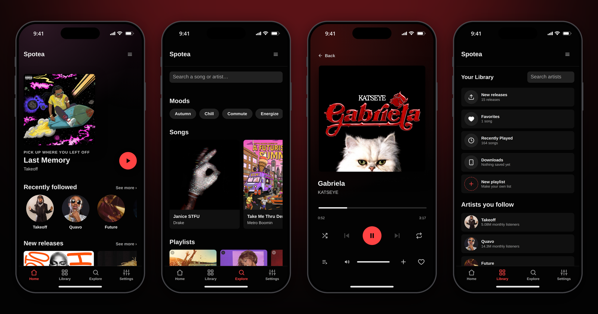

<p align="center">
  
</p>

<h1 align="center">Spotea</h1>

<p align="center">
  <b>Your own music streaming app.</b><br>
  Built on YouTube Music. Self-hosted, free, and it keeps playing offline.
</p>

<p align="center">
  <a href="https://github.com/sertacartun/spotea/actions/workflows/tests.yml"></a>
  <a href="LICENSE"></a>
  
</p>

<p align="center">
  
</p>

## Why Spotea?



- 🎤 **Follow artists.** New releases from the artists you follow show up on Home.
- 🔎 **Explore the whole catalogue.** Search YouTube Music for songs, artists, albums, charts and moods.
- ✨ **Recommendations based on who you follow.** Explore suggests songs and artists from your library.
- 📝 **Synced lyrics.** Lyrics scroll along with the song.
- 🎶 **Your own playlists.** Plus Favorites and Recently Played.
- 📥 **Downloads you own.** Audio is saved to your disk and can be exported as one zip.
- ✈️ **Offline playback.** Keep songs on your phone and play them with no connection.
- 📱 **Installs like an app.** Add it to your home screen on iOS or Android.

<br clear="right">

<p align="center">
  
</p>

## Get started

You only need [Docker](https://docs.docker.com/get-docker/).

```bash
git clone https://github.com/sertacartun/spotea.git && cd spotea
cp .env.example .env        # then set SECRET_KEY in .env
docker compose up -d
```

Open **http://localhost:8000** and create your account. That's it.

To update later: `git pull && docker compose up -d --build`. Your music in `./data` stays.

## More

- [Self-hosting guide](docs/SELF_HOSTING.md): configuration, HTTPS, running without Docker
- [Architecture](ARCHITECTURE.md): how it works inside
- [Contributing](CONTRIBUTING.md)

## License

MIT. See [LICENSE](LICENSE).
